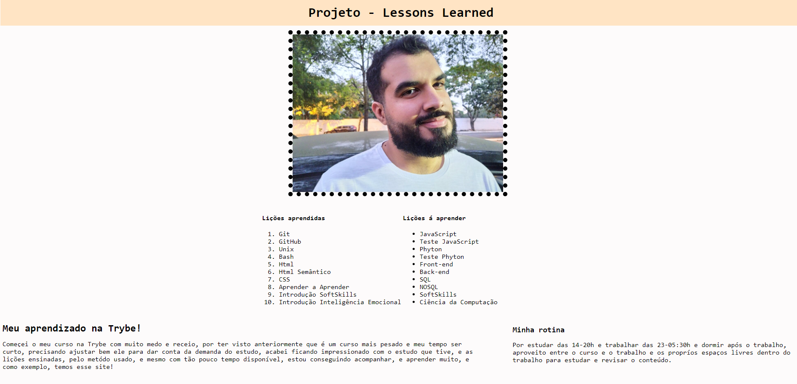

# Lessons Learned

Página de apresentação sobre mim, utilizando Html e Css, quando iniciei o curso da Trybe.
## Demonstração

## Stack utilizada

**Front-end:** Html, Css

## Aprendizados

Utilizar tags semânticas no Html, organizar o site utilizando o Css.
## Instalação

Coloque a pasta lessons-learned no local desejado.

## Rodando localmente

Execute o arquivo `index.html` em seu navegador e pronto!

## Autores
### Gabriel

|  |  |  |
| ------|-------|-----|
